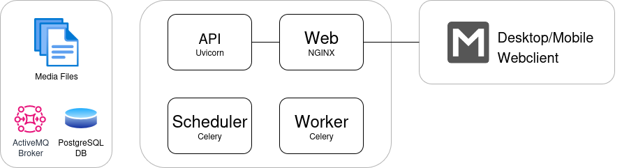

# MixMatch

**MixMatch** is an open source music organizer for harmonic mixing.

The software analyzes AIFF, MP3, MP4 and FLAC files and determines the musical key and tempo of each file. It helps DJs to
find tracks that are harmonically compatible with each other.

# Features
- HTML5 webinterface for both mobile and desktop
- Calculates KEY and BPM values for compatible audio files
- Advanced search capabilities
- Create playlists to organize music
- Show and update cover images
- ID3 tag editor
- Multi user support

# Components
The MixMatch application consists of following components:

- **MixMatch Web** (``mixmatch-web``)： NGINX webserver is used to offload SSL, acts as reverse proxy for the MixMatch API as well as serving media files and the Angular based web application.
- **MixMatch API** (``mixmatch-api``)： MixMatch API package contains a light-weight Python HTTP server uvicorn that serves the FastAPI based rest-api service.
- **MixMatch Scheduler** (``mixmatch-scheduler``)： MixMatch Scheduler package contains a job scheduler based on Celery.
- **MixMatch Worker** (``mixmatch-worker``)： MixMatch Worker package contains a job worker based on Celery for importing and analysing music files.
- **PostgreSQL** (``mixmatch-db``)： PostgreSQL relational database backend for MixMatch.
- **RabbitMQ** (``mixmatch-rabbitmq``)： RabbitMQ broker for MixMatch.

# Getting Started
The application is distributed as several Docker images. Refer to the following deployment options:

- [Deploy with Docker Compose](deploy-with-docker-compose.md)

# Libraries
The MixMatch application is developed using several third party frameworks and libraries, most notable:

- **Angular** ： <https://angular.dev>
- **Bootstrap** ： <https://getbootstrap.com>
- **Celery** ： <https://docs.celeryq.dev>
- **Essentia** ： <https://essentia.upf.edu/index.html>
- **FastAPI** ： <https://fastapi.tiangolo.com>
- **Mutagen** ： <https://mutagen.readthedocs.io>
- **SQLModel** ： <https://sqlmodel.tiangolo.com>
- **Uvicorn** ： <https://www.uvicorn.org>
- **WhiteNoise** ： <http://whitenoise.evans.io>

# License
The different components of MixMatch application are released under different licenses:

* MixMatch Server: [BSD 3-Clause License](../LICENSE)
* Bundled NGINX Webserver: <https://nginx.org/LICENSE>
* Bundled PostgreSQL Database: <https://opensource.org/licenses/postgresql>
* Bundled RabbitMQ Broker: <https://www.tldrlegal.com/license/mozilla-public-license-2-0-mpl-2>
